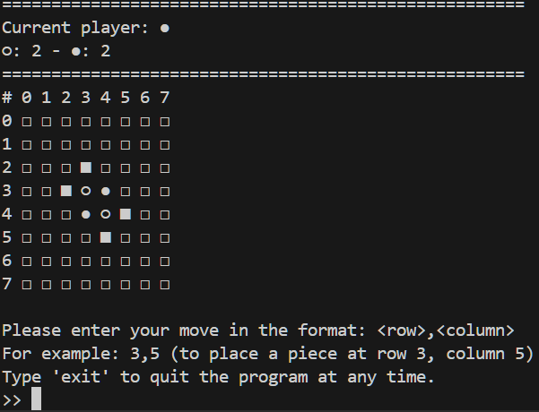

# Othello
Project for Algorithms and Data Structures.

- Revisited and updated 21.9.2024.
- Created GUI 23.9.2024.

## Overview
This project is a Python implementation of the Othello game, originally created as a console-only version for Player vs Bot. It now features two modes of play: Player vs Player and Player vs Bot. Additionally, it offers two interfaces: a **console interface** (available only for Player vs Bot) and a **graphical user interface (GUI)** for an enhanced gaming experience.


### GUI

### Console


# Usage
Make sure to have **PyQt5** intelled:
```
pip install -r requirements.txt 
```
Run the application with the following command for the default option (GUI: Player vs Bot):
```
python3 ./src/main.py
```
## Command Options
- For console option:
```
python3 ./src/main.py [--console | -c]
```
- For GUI option vs bot:
```
python3 ./src/main.py [--ui | -u] [--bot | -b]
```
- For GUI option vs player:
```
python3 ./src/main.py [--ui | -u] [--player | -p]
```

# Dependencies:

- PyQt5 for GUI

# References:
- Othello: https://en.wikipedia.org/wiki/Reversi
- Heruistic: https://kartikkukreja.wordpress.com/2013/03/30/heuristic-function-for-reversiothello/
